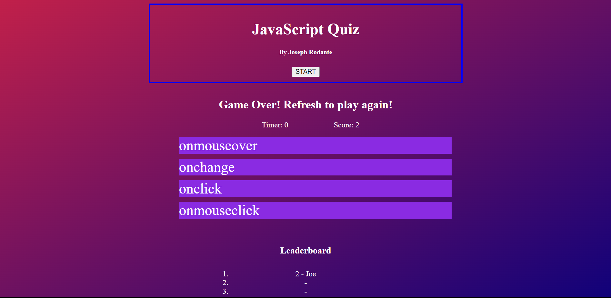

# Module 4 Challenge

- This is the README for the repository of the Module 4 Challenge of Joseph Rodante in Rutgers Coding Bootcamp. - This application is a timed quiz on JavaScript that will award points to the player based on how many questions they answered correctly and on how much time is remaining. The player's score will be displayed at the bottom of the page once the quiz is completed.

## Installation

- N/A
- [Link to Website](https://joeyrodo.github.io/JavaScript-Quiz/) 

## Usage

- Click START to start the quiz.
- Answer the questions in the given time.
- Enter your name once the quiz is finished and see your score and name on the leaderboard.
- Refresh the page to try again.

